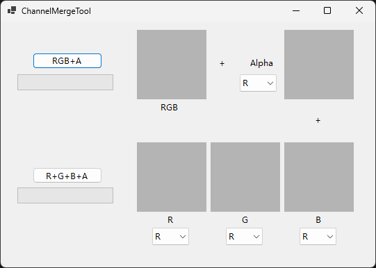

本项目由AI生成，只是简单的合并贴图通道到一个png图片里面。

因为不知道GIMP要怎么编辑通道，就直接自己做一个软件用。

RGBA 通道合成工具（WinForms）

一个基于 C# 和 Windows Forms 的图像工具，支持从多张图片中提取不同的颜色通道（R/G/B/A），并合成为一张新的 PNG 图片。

支持加载最多 4 张图片，分别用于 R/G/B/A 通道

每张图片可选择提取的通道（Red / Green / Blue / Alpha）

使用 LockBits + unsafe 优化图像处理性能

C# .NET 8 / WinForms

使用

通道合成的时候主要是alpha通道比较不好处理，

rgb通道的合并在一般图片软件都可以处理，只要最下面的图层填充纯黑，然后上面的图层模式改成“相加”，然后一个图层一个颜色，最后导出的图片就是包含rgb通道的图片，

所以这个软件主要有两种合成方式:

RGB+A : 一张图片包含rgb，加一另张包含alpha通道就可以完成。

R+G+B+A :每个通道一张图片，用4张图片合成一张图片。

合成时如果相应通道没有选择图片，则该通道值为0
